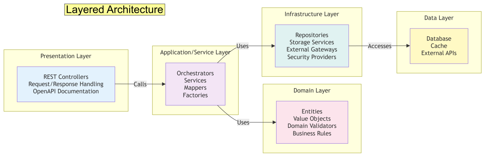
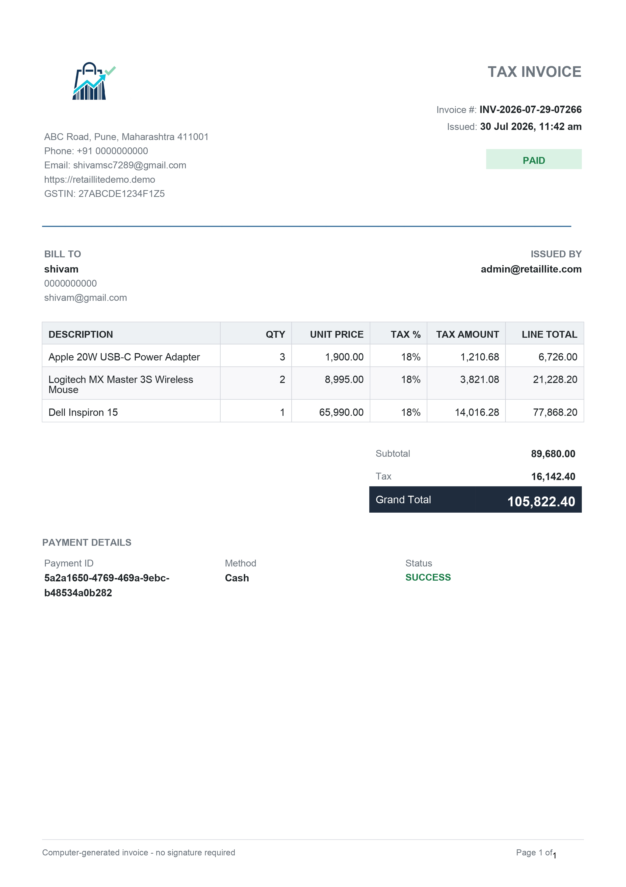
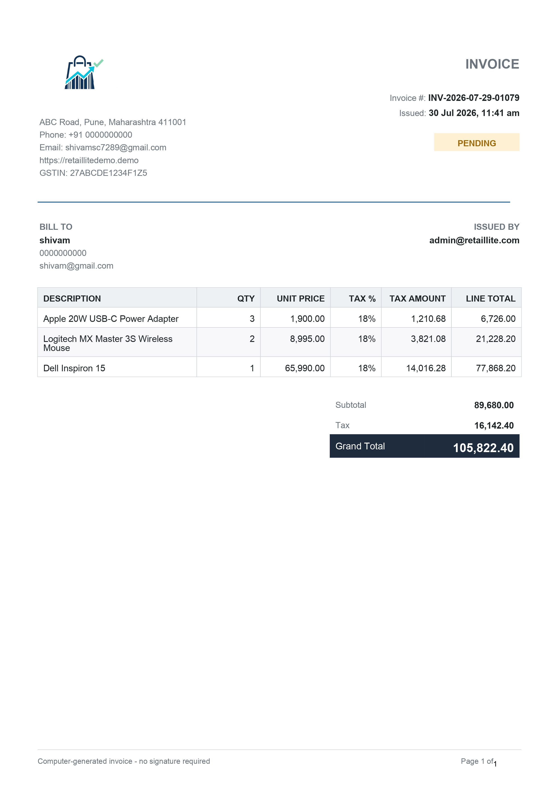
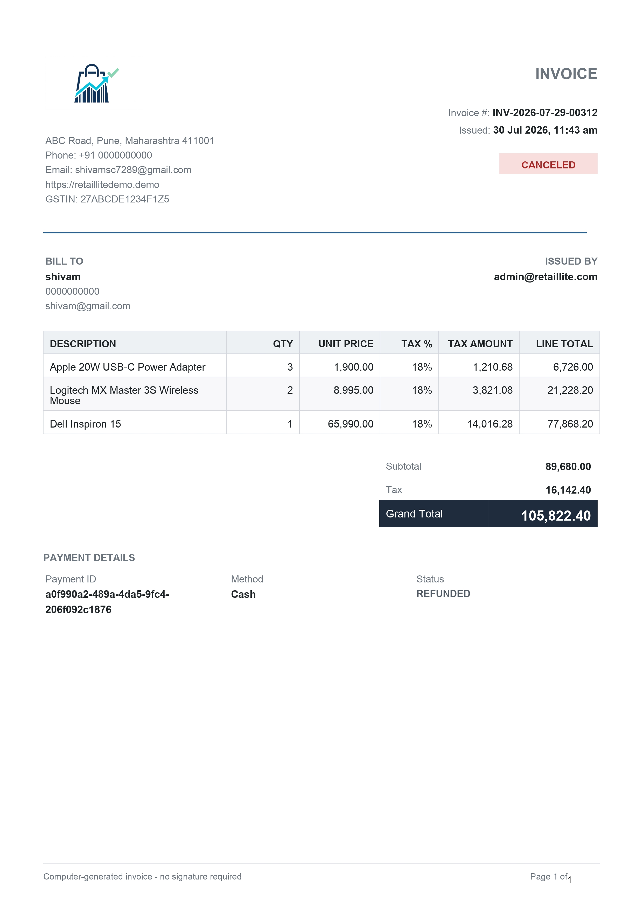
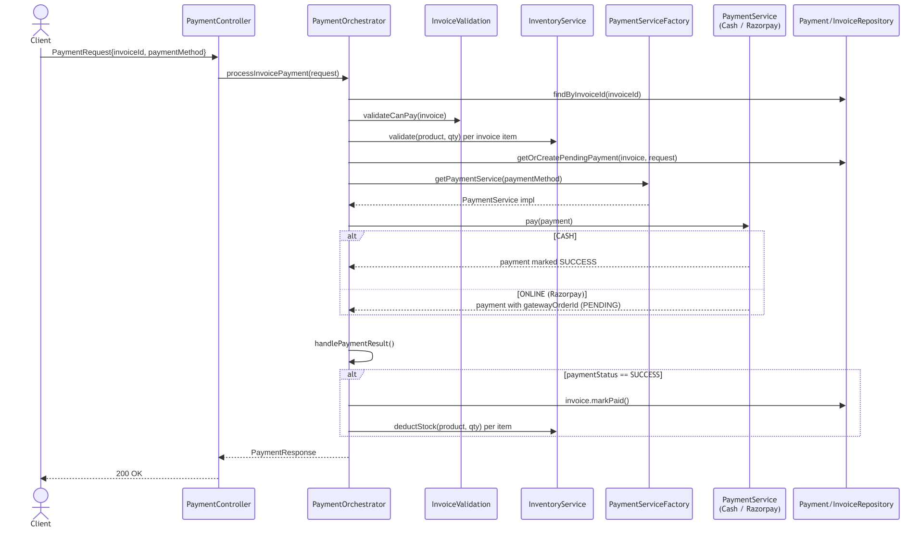
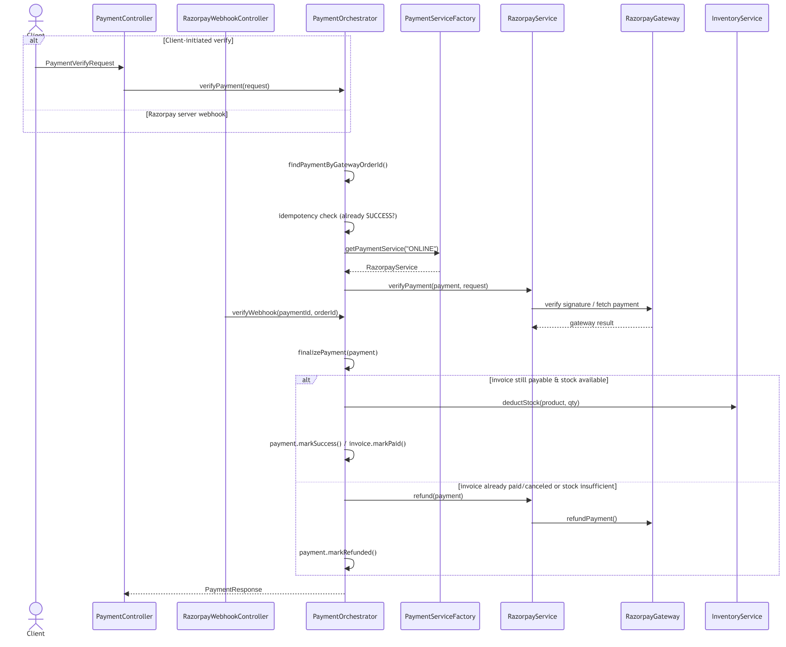
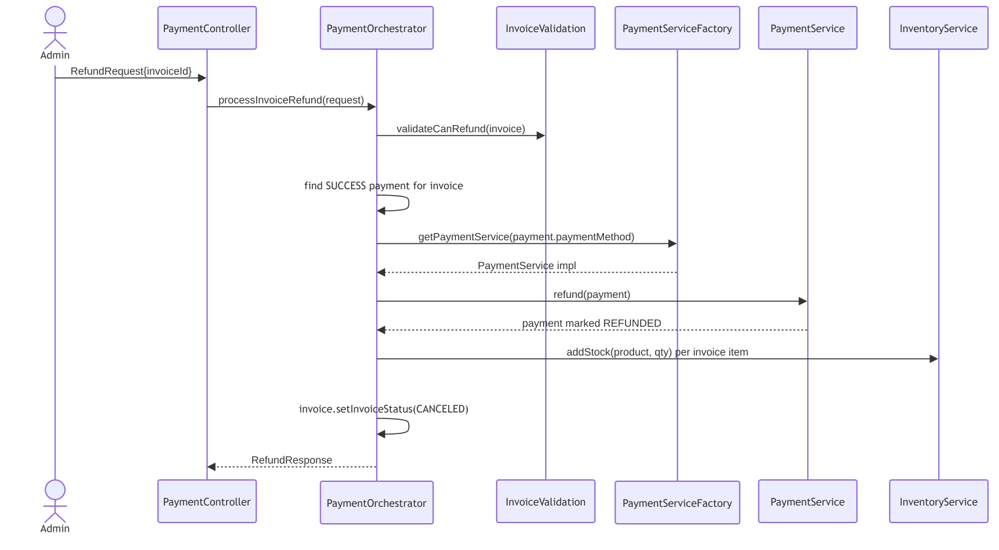
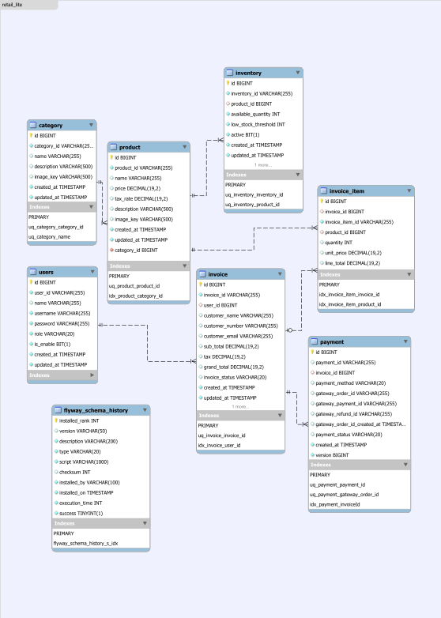

<div align="center">

# 🛒 RetailLite

**A modular, Enterprise Grade Retail Management REST API**
Catalog · Inventory · Invoicing · Payments — built with Spring Boot 3 and Java 21

<p>
  
  
  
  
</p>
<p>
  
  
  
  
  
  
  
  
  
</p>

[Overview](#-overview) · [Architecture](#-architecture) · [Modules](#-modules) · [Design Highlights](#-design-highlights) · [Diagrams](#-diagrams) · [Getting Started](#-getting-started) · [API](#-api-surface) · [Docs](#-full-documentation)

</div>

---

## 📌 Overview

RetailLite models the full sales lifecycle for a small retail business — from catalog to cash in hand:

```
categories → products → inventory → invoices → payments (cash / Razorpay) → PDF receipts
```

It's an Enterprise-grade backend project deliberately built the way a real production service would be:
feature-sliced packages instead of a generic `controller/service/repo` soup, a **Strategy pattern**
for pluggable payment methods, a **composable renderer pipeline** for PDF invoices, **optimistic
locking** on every mutable financial/stock entity, and **stateless JWT auth** enforced at the method
level.

## 🏗 Architecture

RetailLite is a **layered modular monolith**. 

<p align="center">
  
</p>


Every feature module follows the same
`Controller → Application/Service layer → Domain layer → Repository` shape and is isolated by package
(`in.shivam.retaillite.<module>`), with a `common` package for cross-cutting concerns.
<p align="center">
  
</p>

*A more detailed, per-layer breakdown (module dependency graph, package structure, data flow) lives
in [docs/architecture.md](docs/architecture.md).*

**Request lifecycle:**

1. Request hits Spring Boot on context path **`/api/v1.0`**.
2. `JwtRequestFilter` (registered ahead of `UsernamePasswordAuthenticationFilter`) validates the
   Bearer token and populates the `SecurityContext`.
3. `@PreAuthorize` on the controller (method- or class-level) enforces `ROLE_ADMIN` / `ROLE_USER`.
4. The controller delegates to a service interface; the implementation applies business rules and
   talks to Spring Data JPA repositories.
5. Hibernate persists to MySQL 8. Schema is owned entirely by **Flyway**
   (`ddl-auto: validate` — Hibernate verifies its mappings at startup, never alters DDL).

📄 Full write-up: **[docs/architecture.md](docs/architecture.md)**

## Sample Invoices

### 1. Paid Invoice



### 2. Pending Invoice




### 3. Payment Refunded/ Canceled Invoice


## 📦 Modules

| Module | Responsibility | Docs |
|---|---|---|
| 🔐 `auth` | JWT issuance/validation, Spring Security configuration | [→](docs/modules/auth.md) |
| 👤 `user` | Admin-managed staff accounts & roles | [→](docs/modules/user.md) |
| 🏷️ `category` | Product categories with image upload | [→](docs/modules/category.md) |
| 📦 `product` | Product catalog: pricing, tax rate, category linkage | [→](docs/modules/product.md) |
| 📊 `inventory` | Stock levels, low-stock thresholds, reserve/deduct/restore | [→](docs/modules/inventory.md) |
| 🧾 `invoice` | Invoice lifecycle + composable PDF generation | [→](docs/modules/invoice.md) |
| 💳 `payment` | Strategy-based payments (Cash/Razorpay), refunds, webhooks | [→](docs/modules/payment.md) |
| ☁️ `storage` | Pluggable file storage — local disk or AWS S3 | [→](docs/modules/storage.md) |

## 💡 Design Highlights

full rationale in
**[docs/design-decisions.md](docs/design-decisions.md)**:

- **Strategy pattern for payments** — `PaymentServiceFactory` builds a `Map<String, PaymentService>`
  from every Spring bean implementing `PaymentService`, keyed by its own `getPaymentMethod()`.
  Adding UPI or card support later is a new `@Service` bean — zero changes to the orchestrator.
- **Transactional orchestration** — `PaymentOrchestrator` is the single seam that coordinates
  invoice validation, inventory reservation, gateway calls, and state transitions in one unit of
  work, with automatic refund + invoice cancellation if a post-hoc stock shortfall is detected.
- **Composite PDF renderers** — invoice PDFs are assembled from five independent, stateless
  `InvoiceSectionRenderer` implementations (header, parties, items, totals, payment) instead of one
  monolithic generator method.
- **Optimistic locking everywhere it matters** — `Inventory`, `Invoice`, and `Payment` each carry a
  `@Version` column, so concurrent stock deductions and payment transitions fail safely instead of
  silently corrupting state.
- **Interface-segregated storage** — `CategoryService`/`ProductService` depend only on the
  `StorageService` interface; local disk and S3 are interchangeable at config time.
- **Idempotent payment verification** — both the client-verification endpoint and the Razorpay
  webhook short-circuit on an already-`SUCCESS` payment, so replayed webhooks never double-process.

## 🖼 Diagrams

<summary><strong>Sequence diagrams</strong> — login, authenticated request, pay/verify/refund</summary>
<br/>

**Login**


**Authenticated request (JWT filter chain)**


**Pay an invoice**



**Verify an online payment**



**Refund a payment**




<summary><strong>Class / UML diagrams</strong> — per module</summary>
<br/>

| Module    | Diagram                                                                                |
|-----------|----------------------------------------------------------------------------------------|
| Auth      | [`diagrams/modules/auth-uml.md`](diagrams/module/auth-uml.md)                        |
| User      | [`diagrams/modules/user-uml.md`](diagrams/module/user-uml.md)                        |
| Category  | [`diagrams/modules/category-uml.md`](diagrams/module/category-uml.md)                |
| Product   | [`diagrams/modules/product-uml.md`](diagrams/module/product-uml.md)                  |
| Inventory | [`diagrams/modules/inventory-uml.md`](diagrams/module/inventory-uml.md)              |
| Invoice   | [`diagrams/modules/invoice-uml.md`](diagrams/module/invoice-uml.md)                  |
| Payment   | [`diagrams/modules/payment-uml.md`](diagrams/module/payment-uml.md)                  |
| Storage   | [`diagrams/modules/storage-uml.md`](diagrams/module/storage-uml.md)                  |

<br/>

<summary><strong>Entity-relationship diagram</strong></summary>
<br/>

<br/>

</details>

## 🧰 Tech Stack

| Layer | Technology |
|---|---|
| Language / Runtime | Java 21 |
| Framework | Spring Boot 3.5.6 (Web, Security, Data JPA, Validation) |
| Auth | Spring Security + JWT (`jjwt` 0.12.7), BCrypt, method-level `@PreAuthorize` |
| Database | MySQL 8, Hibernate (Spring Data JPA) |
| Payments | Razorpay Java SDK 1.4.8 (orders, signature verification, refunds, webhooks) |
| File Storage | AWS S3 SDK v2 (2.44.7) or local disk — pluggable |
| PDF Generation | OpenPDF 1.3.30 |
| API Docs | springdoc-openapi 2.8.9 (Swagger UI) |
| Testing | JUnit 5, Mockito, `spring-security-test`, H2 (in-memory) |
| Build / Runtime | Maven, multi-stage `Dockerfile`, Docker Compose |

## 🚀 Getting Started

```bash
# 1. Provide a .env with DB / JWT / AWS / Razorpay secrets (see docs/getting-started.md), then:
docker compose up --build
```

App runs at `http://localhost:8080/api/v1.0` · Swagger UI at `/swagger-ui/index.html`.

Full local (non-Docker) setup, required environment variables, and test instructions:
**[docs/getting-started.md](docs/getting-started.md)**

## 📡 API Surface

Base path: **`/api/v1.0`**. Every route requires `Authorization: Bearer <jwt>` unless explicitly
marked public (`/auth/login`, Swagger UI, `/uploads/**`, `/webhooks/razorpay`).

| Resource | Endpoints |
|---|---|
| `auth` | `POST /auth/login` |
| `user` *(admin)* | `POST /user/register` · `DELETE /user/{id}` · `GET /user/users` |
| `category` | `POST /category` · `GET /category/categories` · `DELETE /category/{id}` |
| `product` | `POST /product` · `GET /product/products` · `DELETE /product/{id}` |
| `inventory` *(admin)* | add/remove stock · low-stock threshold · low-stock report |
| `invoices` | create · list · get · filter by status · download PDF |
| `payment` | `POST /payment/pay` · `/payment/verify` · `/payment/refund` |
| `webhooks` | `POST /webhooks/razorpay` *(public, signature-verified)* |

Full request/response contracts, roles, and pagination params:
**[docs/api-reference.md](docs/api-reference.md)** · interactive docs at `/swagger-ui/index.html`.

## 📂 Project Structure

```
src/main/java/in/shivam/retaillite/
├── auth/            # JWT, Spring Security config
├── user/            # Staff accounts
├── category/        # Categories
├── product/         # Product catalog
├── inventory/        # Stock levels & thresholds
├── invoice/          # Invoices + PDF generation subsystem
├── payment/          # Strategy-based payments, refunds, webhooks
├── storage/           # Local / S3 file storage
└── common/            # Enums, GlobalExceptionHandler, shared validation
```

Each module owns its full vertical slice (`controller / service / repository / entity / dto /
exception`) — new features are added by module, not spread across shared layers.

## ✅ Testing

```bash
./mvnw test
```

Unit tests (JUnit 5 + Mockito) cover services, controllers, and validation per module; integration
tests under `integration/` exercise auth, payment (cash/Razorpay/refund/rollback), and persistence
against H2.

## 📖 Full Documentation

| | |
|---|---|
| 📘 [Documentation Index](docs/README.md) | 🏗️ [Architecture](docs/architecture.md) |
| 💡 [Design Decisions](docs/design-decisions.md) | 🗄️ [Database Schema](docs/database-schema.md) |
| 📡 [API Reference](docs/api-reference.md) | ⚠️ [Error Reference](docs/errors.md) |
| 🔒 [Security](docs/security.md) | 🚀 [Getting Started](docs/getting-started.md) |
| 📂 [Module Docs](docs/README.md#modules) | |


## 🗺 Known Limitations / Roadmap

Documented honestly rather than hidden:

- `S3StorageService` is present but marked incomplete in source (`//todo`) — local disk storage is
  the default, working path today.
- No CI pipeline configured yet.
- No license file yet — add one before public/commercial distribution.
- The seeded root admin (see [Getting Started](docs/getting-started.md)) uses a documented default
  password — rotate it before any real deployment.

## 📄 License

This project is licensed under the Apache License, Version 2.0. See the [LICENSE](LICENSE) file for the full text.

```xml
<!-- Declared in pom.xml -->
<licenses>
    <license>
        <name>Apache License, Version 2.0</name>
        <url>https://apache.org</url>
        <distribution>repo</distribution>
    </license>
</licenses>
```
---

<div align="center">
<sub>Built by Shivam · package root <code>in.shivam.retaillite</code></sub>
</div>
