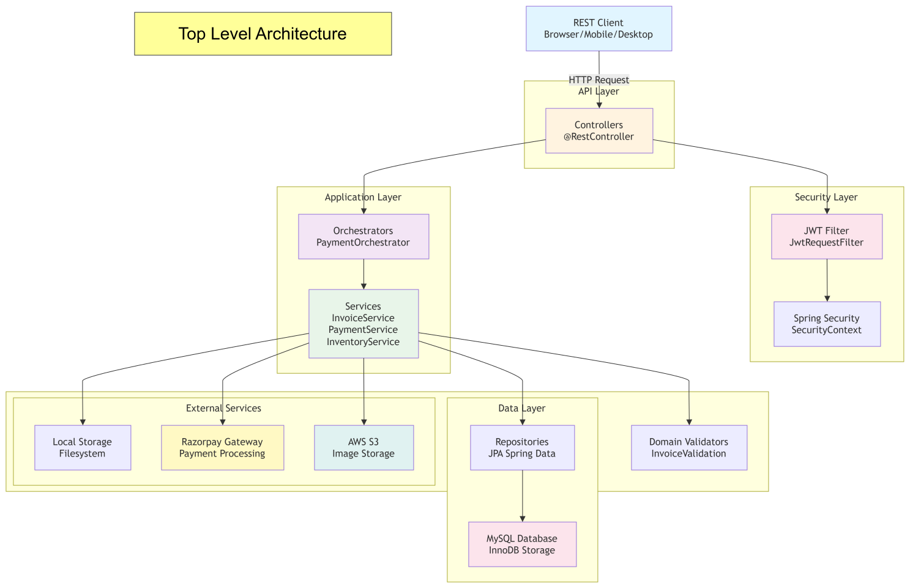
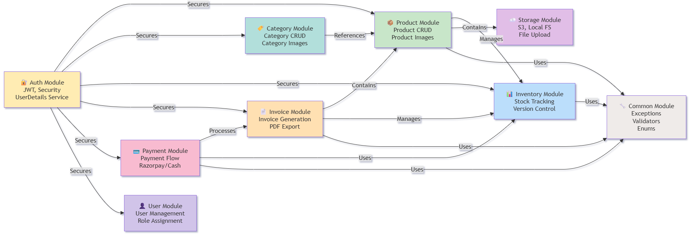
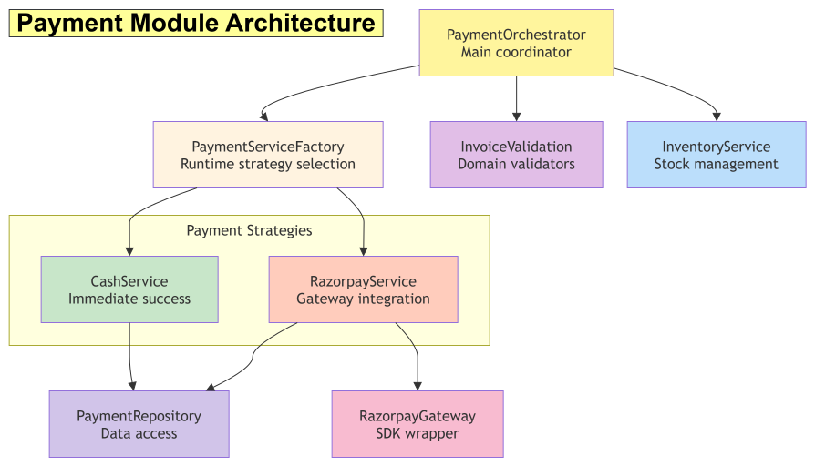
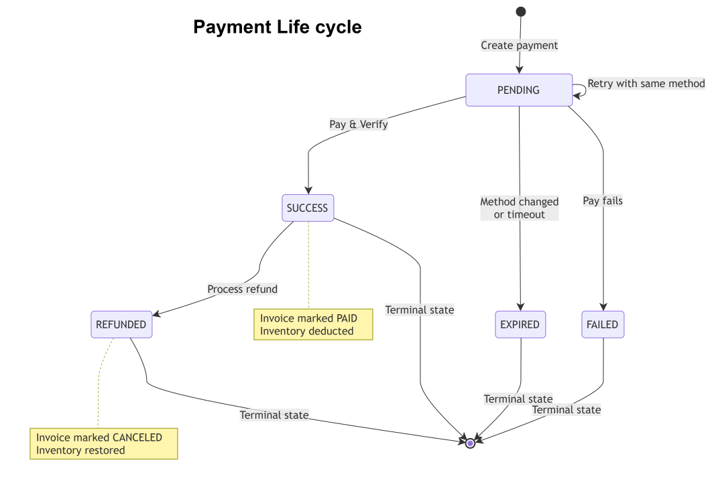
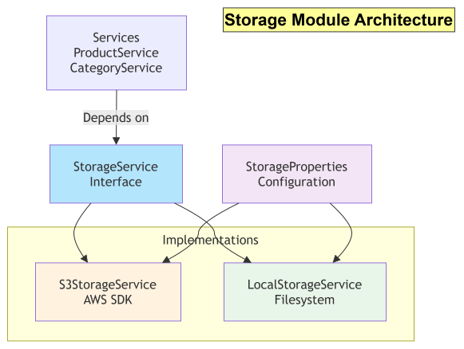
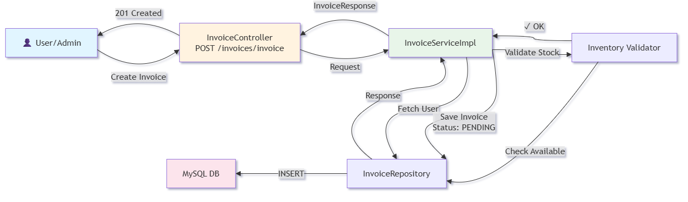

# RetailLite Architecture Documentation

## Table of Contents

1. [System Architecture](#system-architecture)
2. [Module Dependency Graph](#module-dependency-graph)
3. [Package Diagram](#package-diagram)
4. [Core Components](#core-components)
5. [Data Flow](#data-flow)
6. [External Integrations](#external-integrations)
7. [Architectural Principles](#architectural-principles)
8. [Scalability Considerations](#scalability-considerations)
9. [Database Design](#database-er-diagram)

## System Architecture


### High-Level Architecture



Schema is owned entirely by **Flyway** (`ddl-auto: validate` — Hibernate verifies its mappings at
startup but never alters DDL). See [Design Decisions §10](design-decisions.md#10-schema-owned-entirely-by-flyway-hibernate-set-to-validate)
for the full rationale.

### Layered Architecture Pattern


## Module Dependency Graph

### Inter-Module Dependencies



## Package Diagram

Every module owns its full vertical slice — no shared `controller`/`service`/`repository` layer
spanning modules. New features are added by module, not spread across shared layers:

```
in.shivam.retaillite/
├── auth/       controller · service · security (JwtRequestFilter, SecurityConfig)
├── user/       controller · service · repository · entity · dto
├── category/   controller · service · repository · entity · dto · exception
├── product/    controller · service · repository · entity · dto · exception
├── inventory/  controller · service · repository · entity · dto · exception
├── invoice/    controller · service · repository · entity · dto · pdf (renderer pipeline)
├── payment/    controller · application (orchestrator, factory) · service · gateway · entity
├── storage/    service (interface + Local/S3 implementations) · config
└── common/     enums · GlobalExceptionHandler · shared validation
```

See [Design Decisions §1](design-decisions.md#1-layered-modular-monolith-sliced-by-feature) for the
reasoning behind this boundary.
## Core Components

### 1. Authentication System

**Location:** `auth/`

**Responsibilities:**
- User authentication via credentials
- JWT token generation and validation
- Request filter for token validation
- Spring Security integration

**Key Classes:**

| Class | Purpose |
|-------|---------|
| `AuthController` | Login endpoint |
| `AuthService` | Authentication orchestration |
| `JwtService` | Token generation/validation (JJWT 0.12.7) |
| `JwtRequestFilter` | Request interceptor for token validation |
| `AppUserDetailsService` | Custom UserDetailsService for Spring Security |
| `UserSecurityService` | Additional security operations |

**Flow:**

### a. Login Request


### b. Authenticated Request


### 2. Invoice Module

**Location:** `invoice/`

**Responsibilities:**
- Invoice creation from items
- Invoice lifecycle management (PENDING → PAID/CANCELED)
- PDF generation with company branding
- Invoice retrieval with filtering

**Key Classes:**

| Class | Purpose | Role |
|-------|---------|------|
| `InvoiceController` | REST endpoints | Presentation |
| `InvoiceService` | Business logic interface | Application |
| `InvoiceServiceImpl` | Invoice operations | Application |
| `InvoicePdfService` | PDF generation | Application |
| `Invoice` | Main entity with version control | Domain |
| `InvoiceItem` | Line items | Domain |
| `InvoiceStatus` | Enum: PENDING, PAID, CANCELED | Domain |
| `OpenPdfInvoiceGenerator` | PDF rendering | Infrastructure |
| Mapper classes | DTO ↔ Entity conversion | Application |

**Database Schema:**

`invoice` (header fields, `@Version` for optimistic locking) and `invoice_item` (line items, cascade
`ALL` + orphan removal from `Invoice`) — see [Database Schema](database-schema.md#tables) for full
column layout and the [ERD](../diagrams/erd/database-erd.md) for the visual relationship.
### 3. Payment Module

**Location:** `payment/`

**Responsibilities:**
- Complex payment orchestration
- Multi-payment method support (CASH, ONLINE)
- Razorpay integration
- Payment status management
- Refund processing

**Architecture:**



**Key Classes:**

| Class | Purpose | Pattern |
|-------|---------|---------|
| `PaymentOrchestrator` | Main payment flow | Orchestrator |
| `PaymentServiceFactory` | Strategy selection | Factory |
| `PaymentService` | Interface | Strategy |
| `CashService` | Cash payment handler | Strategy Implementation |
| `RazorpayService` | Online payment handler | Strategy Implementation |
| `RazorpayGateway` | Razorpay SDK wrapper | Gateway/Adapter |
| `Payment` | Entity with version control | Domain |
| `InvoiceValidation` | Validation rules | Domain Validator |

**Payment Lifecycle:**



**Concurrency & Idempotency:**
- Optimistic locking via @Version on Payment entity
- Pending payment reuse for retries
- Payment status checks before state transitions
- Automatic refund on inventory conflicts
- Invoice version control to detect concurrent modifications

### 4. Inventory Module

**Location:** `inventory/`

**Responsibilities:**
- Real-time stock tracking
- Stock deduction on payment
- Stock restoration on refund
- Low-threshold validation

**Key Classes:**

| Class | Purpose |
|-------|---------|
| `InventoryService` | Stock management (deduct, add, validate) |
| `Inventory` | Entity with optimistic locking (@Version) |
| `InventoryRepository` | JPA repository with custom queries |

**Concurrency Control:**
```java
@Entity
public class Inventory {
    @Version
    private Long version;  // Optimistic locking
    
    private Integer availableQuantity;
    private Integer lowStockThreshold;
}
```

When concurrent modifications occur:
- JPA throws `OptimisticLockException`
- Payment orchestrator catches and triggers refund
- Invoice marked as CANCELED
- Stock remains unchanged

### 5. Storage Module

**Location:** `storage/`

**Responsibilities:**
- Abstract file storage interface
- AWS S3 implementation
- Local filesystem implementation
- File validation

**Interface-Based Design:**



**Supported Storage Backends:**

| Backend | Configuration | Use Case |
|---------|---------------|----------|
| AWS S3 | Cloud storage config | Production, scalability |
| Local Filesystem | `uploads/` directory | Development, testing |

## Data Flow

### Invoice Creation Flow



### Payment Processing Flow

### a. Pay Invoice Flow


### b. Verify Payment Flow


### c. Refund Payment Flow


## External Integrations

### Razorpay Gateway Integration

**Location:** `payment/gateway/RazorpayGateway.java`

**Configuration:**
```yaml
razorpay:
  key-id: ${RAZORPAY_KEY_ID}
  key-secret: ${RAZORPAY_KEY_SECRET}
  webhook-secret: ${RAZORPAY_WEBHOOK_SECRET}
  timeout: 10  # Order ID expiration in minutes
```

**Operations:**
1. **Create Order**: Generate payment order on Razorpay
2. **Verify Signature**: HMAC-SHA256 signature verification
3. **Refund Payment**: Initiate refund via API

**Webhook Flow:**


### AWS S3 Integration

**Location:** `storage/service/impl/S3StorageService.java`

**Configuration:**
```yaml
aws:
  region: ap-south-1
  access-key: ${AWS_ACCESS_KEY}
  secret-key: ${AWS_SECRET_KEY}
  bucket-name: ${BUCKET_NAME}
  endpoint: http://localhost:4566  # LocalStack for dev
```

**Operations:**
1. **Upload File**: `uploadFile(file, key)`
2. **Generate URL**: `getFileUrl(key)`
3. **Delete File**: `deleteFile(key)`

**LocalStack for Development:**
```bash
docker run -d -p 4566:4566 localstack/localstack
aws configure --profile localstack
aws s3 mb s3://retaillite-bucket --endpoint-url http://localhost:4566
```

## Architectural Principles

### 1. SOLID Principles

#### Single Responsibility Principle (SRP)
- Each class has one reason to change
- `PaymentService`: payment processing only
- `InventoryService`: inventory operations only
- `InvoiceService`: invoice management only

#### Open/Closed Principle (OCP)
- Open for extension, closed for modification
- `PaymentService` interface allows new payment methods
- `StorageService` interface supports multiple backends
- Factory pattern enables runtime selection

#### Liskov Substitution Principle (LSP)
- Subtypes must be substitutable
- `CashService` and `RazorpayService` are interchangeable
- Both implement `PaymentService` interface
- `S3StorageService` and `LocalStorageService` can be swapped

#### Interface Segregation Principle (ISP)
- Clients depend on specific interfaces
- `PaymentService`: only payment-related methods
- `StorageService`: only storage-related methods
- No "fat" interfaces with unrelated operations

#### Dependency Inversion Principle (DIP)
- Depend on abstractions, not concretions
- Controllers inject interfaces, not implementations
- Factories abstract implementation selection
- Spring's dependency injection enables this pattern

### 2. Clean Architecture Layers

**Dependency Rule:** Inner layers don't know about outer layers

```
Infrastructure ← Application ← Domain → Entities
  (DB, APIs)    (Services)   (Rules)
```

**Layer Responsibilities:**

| Layer | Responsibility | Examples |
|-------|----------------|----------|
| Domain | Business rules, entities | Invoice, Payment, Validation |
| Application | Use cases, coordination | PaymentOrchestrator, Services |
| Infrastructure | External access, persistence | Repositories, Gateways |
| Presentation | HTTP handling, serialization | Controllers, DTOs |

### 3. Transaction Management

**@Transactional Boundaries:**

```java
// PaymentOrchestrator.processInvoicePayment()
@Transactional
public PaymentResponse processInvoicePayment(PaymentRequest request) {
    // Atomicity: All-or-nothing
    // Consistency: Valid state transitions
    // Isolation: No interference with other transactions
    // Durability: Persisted to database
}
```

**ACID Compliance:**
- **Atomicity**: TransactionManager ensures all-or-nothing
- **Consistency**: Validators check business rules
- **Isolation**: Database transaction isolation level
- **Durability**: MySQL InnoDB storage engine

### 4. Exception Handling Strategy

**Exception Hierarchy:**


**Global Exception Handler:**
```java
@RestControllerAdvice
public class GlobalExceptionHandler {
    
    @ExceptionHandler(ResourceNotFoundException.class)
    public ResponseEntity<ErrorResponse> handleNotFound(...) {
        return ResponseEntity.status(HttpStatus.NOT_FOUND)
                .body(new ErrorResponse(...));
    }
    
    @ExceptionHandler(PaymentException.class)
    public ResponseEntity<ErrorResponse> handlePaymentError(...) {
        return ResponseEntity.status(HttpStatus.CONFLICT)
                .body(new ErrorResponse(...));
    }
}
```

### 5. Concurrency Control

**Optimistic Locking:**

Used on entities frequently updated during concurrent transactions:

```java
@Entity
public class Invoice {
    @Version
    private Long version;
}

@Entity
public class Payment {
    @Version
    private long version;
}

@Entity
public class Inventory {
    @Version
    private Long version;
}
```

**Handling Conflicts:**

```java
try {
    inventoryService.deductStock(product, quantity);
} catch (OptimisticLockException e) {
    // Another transaction modified inventory
    // Trigger automatic refund
    refundPayment(payment);
    invoice.markCanceled();
}
```

### 6. Input Validation Strategy

**Multiple Validation Layers:**

1. **Constraint Validation** (Bean Validation)
   ```java
   @NotBlank(message = "Name is required")
   private String name;
   
   @DecimalMin("0.01")
   private BigDecimal price;
   ```

2. **Business Logic Validation**
   ```java
   public void validateCanPay(Invoice invoice) {
       if (invoice.getInvoiceStatus() == InvoiceStatus.PAID) {
           throw new InvoiceAlreadyPaidException(...);
       }
   }
   ```

3. **Resource Validation**
   ```java
   public void validate(Product product, Integer quantity) {
       if (inventory.getAvailableQuantity() < quantity) {
           throw new QuantityOutOfBoundException(...);
       }
   }
   ```
## Database ER Diagram


## Scalability Considerations

### Current Architecture Strengths

1. **Stateless Services**: Easy horizontal scaling
2. **Database Connection Pooling**: Managed by Spring Boot
3. **Pagination**: Large dataset queries use Page<T>
4. **Lazy Loading**: Related entities loaded on demand
5. **Caching**: Spring Cache abstraction ready


---

**Last Updated**: July 2026