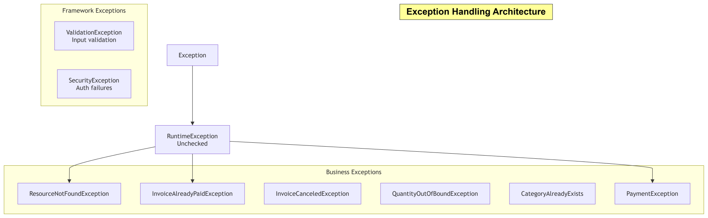

# Error Reference

Every error response returned by the API — validation failures, domain conflicts, auth failures,
and unhandled exceptions alike — shares one shape, produced by `GlobalExceptionHandler`
(`@RestControllerAdvice`):

## Global Exception Handling



```json
{
  "error": "string — short machine-oriented label",
  "message": "string — human-readable detail (or a field->message map, stringified, for validation errors)",
  "status": 409,
  "timestamp": 1753435200000
}
```

`timestamp` is epoch milliseconds (`System.currentTimeMillis()`), not ISO-8601 — worth knowing if
you're parsing it client-side.

## Validation errors (`400`)

`@Valid`-annotated request bodies that fail Bean Validation return `400` with `error` set to a
stringified `{field: message}` map:

```json
{
  "error": "{price=must be greater than or equal to 1, name=size must be between 2 and 50}",
  "message": "validation failed",
  "status": 400,
  "timestamp": 1753435200000
}
```

Triggered by `MethodArgumentNotValidException` (body validation) or `ConstraintViolationException`
(path/query param validation, e.g. `@Min` on a controller method parameter).

## Domain error catalog

| HTTP Status | Exception | Where it's thrown | `error` label |
|---|---|---|---|
| `400` | `MethodArgumentNotValidException` / `ConstraintViolationException` | Any invalid request body/param | field→message map (see above) |
| `400` | `HttpMessageNotReadableException` | Malformed JSON body | `"Http Message not readable exception"` |
| `400` | `QuantityOutOfBoundException` | `POST /inventory/{productId}/stock/remove` — deduction would take stock negative | `"Quantity Out of Bound"` |
| `400` | `InvoiceNotPaidException` | Refunding/acting on an invoice that isn't `PAID` | `"invoice not paid exception"` |
| `400` | `InvoiceCanceledException` | Acting on a `CANCELED` invoice | `"InvoiceCanceledException exception occurred"` |
| `400` | `PaymentVerificationException` | `POST /payment/verify` — Razorpay signature/payload mismatch | `"payment verification failed"` |
| `401` | `AuthenticationException` | `POST /auth/login` — bad credentials | `"unauthorized"` (message: `"invalid username or password"`, deliberately generic — doesn't reveal whether the username exists) |
| `401` | `JwtException` / `ExpiredJwtException` | Missing, malformed, or expired Bearer token on a protected route | `"Authentication error:"` |
| `403` | `AccessDeniedException` / `AuthorizationDeniedException` | Valid token, insufficient role (`@PreAuthorize` failure) | `"access denied"` |
| `403` | `DisabledException` | Authenticating as a disabled user account | `"Account is Disabled"` |
| `403` | `CategoryDeletionException` | Deleting a `Category` that still has `Product`s attached | `"Cannot delete Category for now!"` |
| `404` | `ResourceNotFoundException` | Generic "entity not found by id" across modules | `"Resource not Found"` |
| `404` | `NoResourceFoundException` | No route matches the request | `"Resource not found"` |
| `404` | `UsernameNotFoundException` | *(returns a raw `Map`, not `ErrorResponse` — see note below)* | `"Not Found"` |
| `409` | `UserAlreadyExists` | `POST /user/register` — duplicate username/userId | duplicate-entity message (suggestion: choose another username) |
| `409` | `CategoryAlreadyExists` | `POST /category` — duplicate category name | duplicate-entity message |
| `409` | `InvoiceAlreadyPaidException` | Paying/acting on an invoice already `PAID` | `"InvoiceAlreadyPaidException"` |
| `409` | `ObjectOptimisticLockingFailureException` | Concurrent update lost the `@Version` race (stock, invoice, or payment) | `"concurrent modification exception"` — **safe to retry** |
| *(dynamic)* | `PaymentException` | Payment/gateway-layer failures — carries its own `HttpStatus` per call site | `"payment exception"` |
| *(dynamic)* | `ResponseStatusException` | Any handler that throws with an explicit status | mirrors `e.getReason()` |
| `500` | any uncaught `Exception` | Unexpected/unmapped failures | `"Internal Server Error"` (message: `"Contact support"` — no internals leaked to the client; full detail goes to server logs) |


## Retry guidance

| Status | Retry? |
|---|---|
| `400` | No — fix the request first |
| `401` | No — re-authenticate (`/auth/login`) and retry with a fresh token |
| `403` | No — the account genuinely lacks permission or is disabled |
| `404` | No |
| `409` (`UserAlreadyExists`, `CategoryAlreadyExists`, `InvoiceAlreadyPaidException`) | No — the conflicting state won't change on its own |
| `409` (`ObjectOptimisticLockingFailureException`) | **Yes** — re-fetch current state and retry the operation; this is an expected concurrency signal, not a bug |
| `500` | Maybe — safe to retry idempotent `GET`s; for `POST`/mutating calls, check state before blindly retrying (see [Payment idempotency](modules/payment.md)) |

## Related

- [Security](security.md) — how `401`/`403` fit into the auth flow
- [Payment Module](modules/payment.md) — idempotent verification, refund-on-shortfall behavior
- [Design Decisions §7](design-decisions.md#7-optimistic-locking-on-every-mutable-financialstock-entity) — why `409` on optimistic-lock conflicts is treated as expected, not exceptional
