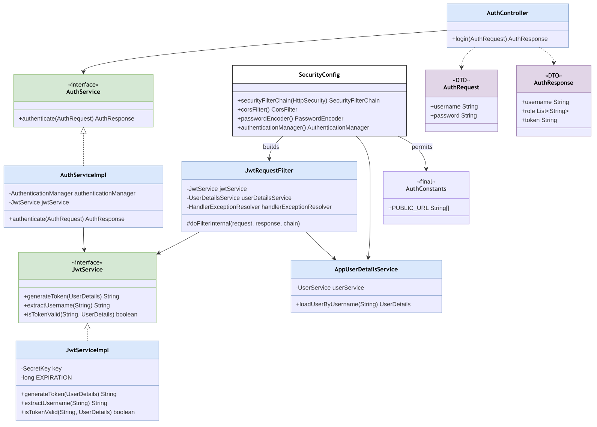
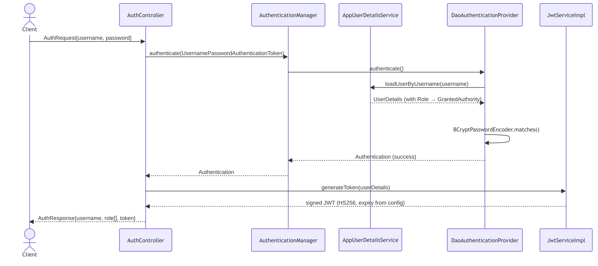
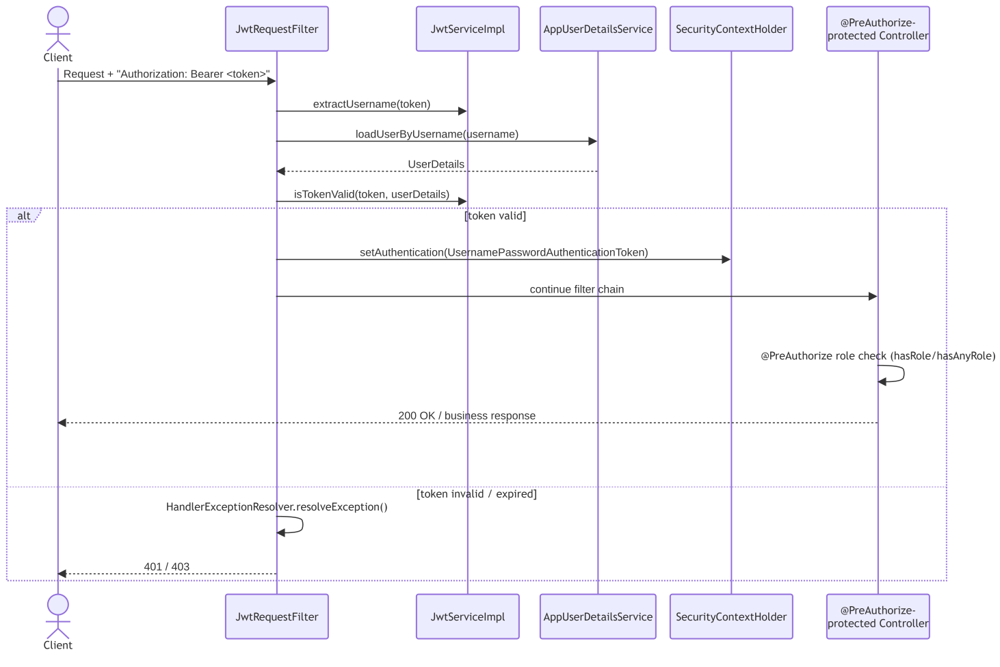

# Auth Module

Package: `in.shivam.retaillite.auth`

📐 **[UML class diagram →]**

🔁 **[Sequence diagrams →]**
## Login (`POST /auth/login` — public)

## Authenticated Request (every other endpoint)

**Public endpoints (`AuthConstants.PUBLIC_URL`):** `swagger-ui/**`, `v3/api-docs/**`, `/auth/login`, `/auth/encode`, `/uploads/**`, `/webhooks/razorpay`. All other routes require a valid Bearer token, and most are further restricted with `@PreAuthorize("hasRole('ADMIN')")` or `hasAnyRole('USER','ADMIN')`.

## Responsibility

Issues and validates JWTs, and configures Spring Security (filter chain, CORS, password encoding,
authentication manager).

## Key classes

| Class | Role |
|---|---|
| `AuthController` | `POST /auth/login` — public endpoint |
| `AuthService` / `AuthServiceImpl` | Delegates to `AuthenticationManager`, then issues a JWT |
| `JwtService` / `JwtServiceImpl` | Generates/validates/parses JWTs (HS256, `jjwt`) |
| `AppUserDetailsService` | Bridges `User` entity → Spring Security `UserDetails` |
| `JwtRequestFilter` | Per-request filter extracting and validating the Bearer token |
| `SecurityConfig` | Security filter chain, CORS, `PasswordEncoder`, `AuthenticationManager` beans |
| `AuthConstants` | Central list of publicly-permitted URL patterns |

## Notes
- CORS currently allows only `http://localhost:5173` (single-origin frontend dev setup).
