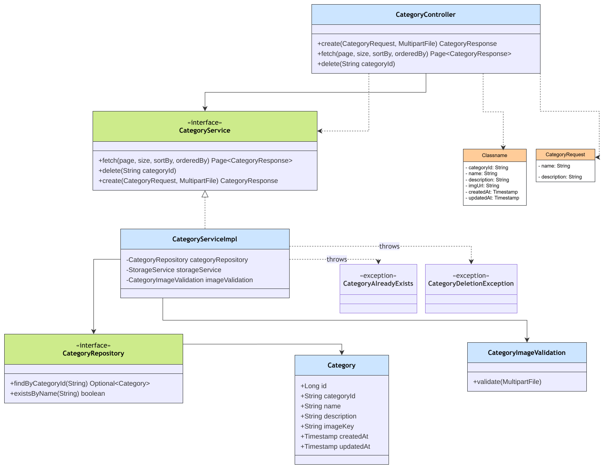

# Category Module

Package: `in.shivam.retaillite.category`

📐 **[UML class diagram →](../../diagrams/module/category-uml.md)**

# Category Module — UML Class Diagram

## Responsibility

Manages product categories, including image upload via the `storage` module.

## Key classes

| Class | Role |
|---|---|
| `CategoryController` | `/category/**` endpoints |
| `CategoryService` / `CategoryServiceImpl` | Create, list, delete categories |
| `CategoryRepository` | Spring Data JPA repository |
| `Category` | Entity: `categoryId`, unique `name`, `description`, `imageKey` |
| `CategoryImageValidation` | Validates uploaded image files |
| `CategoryAlreadyExists` / `CategoryDeletionException` | Domain exceptions |

## API

| Method | Path | Access | Description |
|---|---|---|---|
| POST | `/category` | `ADMIN` | Create (multipart: JSON + image) |
| GET | `/category/categories` | `USER`,`ADMIN` | Paginated list |
| DELETE | `/category/{categoryId}` | `ADMIN` | Delete (blocked if products reference it) |

## Business rule

`Product.category` uses `@OnDelete(RESTRICT)` — deleting a category that still has products throws
`CategoryDeletionException` rather than silently cascading.
