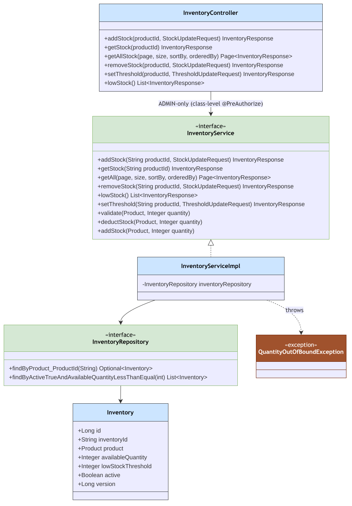

# Inventory Module

Package: `in.shivam.retaillite.inventory`

📐 **[UML class diagram →]**

# Inventory Module — UML Class Diagram

## Responsibility

Tracks available stock per product, low-stock thresholds, and exposes both a REST API and an
internal service contract used by the [payment module](payment.md) to reserve/deduct/restore stock
during checkout and refunds.

## Key classes

| Class | Role |
|---|---|
| `InventoryController` | `/inventory/**` — class-level `ROLE_ADMIN` |
| `InventoryService` / `InventoryServiceImpl` | Add/remove stock, thresholds, low-stock report, plus internal `validate`/`deductStock`/`addStock(Product, int)` overloads |
| `InventoryRepository` | Spring Data JPA repository |
| `Inventory` | Entity: `availableQuantity`, `lowStockThreshold`, `active`, `version` |
| `QuantityOutOfBoundException` | Raised when a deduction would take stock negative |

## API

| Method | Path | Description |
|---|---|---|
| POST | `/inventory/{productId}/stock/add` | Add stock |
| POST | `/inventory/{productId}/stock/remove` | Remove stock |
| GET | `/inventory/{productId}/stock` | Get single stock record |
| GET | `/inventory/stock` | Paginated stock list |
| PATCH | `/inventory/{productId}/stock/low/threshold` | Update threshold |
| GET | `/inventory/stock/low` | Products at/below threshold |

## Concurrency

`Inventory.version` (`@Version`) protects against overselling when multiple payments deduct stock
for the same product concurrently — `PaymentOrchestrator` catches `QuantityOutOfBoundException` and
triggers an automatic refund + invoice cancellation (see [Payment Module](payment.md)).
