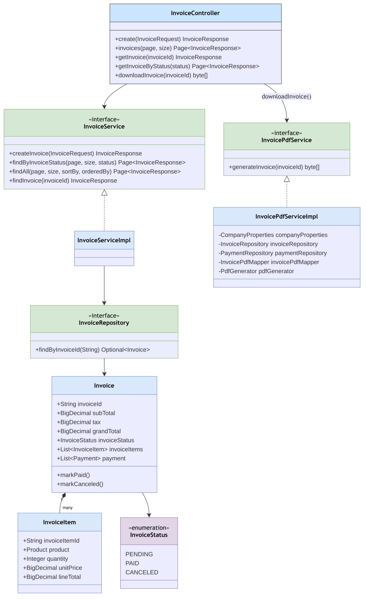
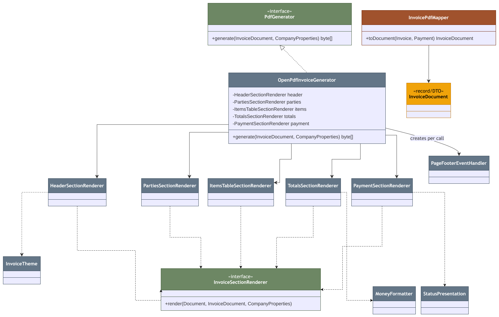

# Invoice Module

Package: `in.shivam.retaillite.invoice`

# Invoice Module — UML Class Diagram

## Core domain & service

## PDF generation subsystem (Strategy + Composite renderers)

## Responsibility

Owns invoice creation/lookup and produces a printable PDF via a dedicated, swappable PDF subsystem.

## Key classes

| Class | Role |
|---|---|
| `InvoiceController` | `/invoices/**` endpoints (class-level `USER`/`ADMIN`) |
| `InvoiceService` / `InvoiceServiceImpl` | Create/list/find invoices |
| `InvoicePdfService` / `InvoicePdfServiceImpl` | Resolves the right `Payment` record per status and builds the PDF |
| `Invoice` / `InvoiceItem` | Entities; `Invoice.markPaid()` / `markCanceled()` encapsulate status transitions |
| `InvoiceStatus` | Enum: `PENDING`, `PAID`, `CANCELED` |

### PDF generation subsystem (`invoice.pdf.*`)

| Class | Role |
|---|---|
| `PdfGenerator` (interface) | *"Single seam between the invoice module and whichever PDF engine is behind it"* (from code docs) |
| `OpenPdfInvoiceGenerator` | Current implementation, built on OpenPDF |
| `InvoiceSectionRenderer` + 5 implementations | One stateless renderer per visual region: header, parties, items table, totals, payment |
| `PageFooterEventHandler` | Page numbering / footer, fresh instance per document |
| `InvoiceTheme`, `MoneyFormatter`, `StatusPresentation` | Styling and formatting helpers |
| `InvoicePdfMapper` | Maps `Invoice` + `Payment` → the rendering-ready `InvoiceDocument` |

## API

| Method | Path | Description |
|---|---|---|
| POST | `/invoices/invoice` | Create invoice |
| GET | `/invoices` | Paginated list |
| GET | `/invoices/{invoiceId}` | Fetch one |
| GET | `/invoices/status/{status}` | Filter by status |
| GET | `/invoices/{invoiceId}/pdf` | Download PDF |
