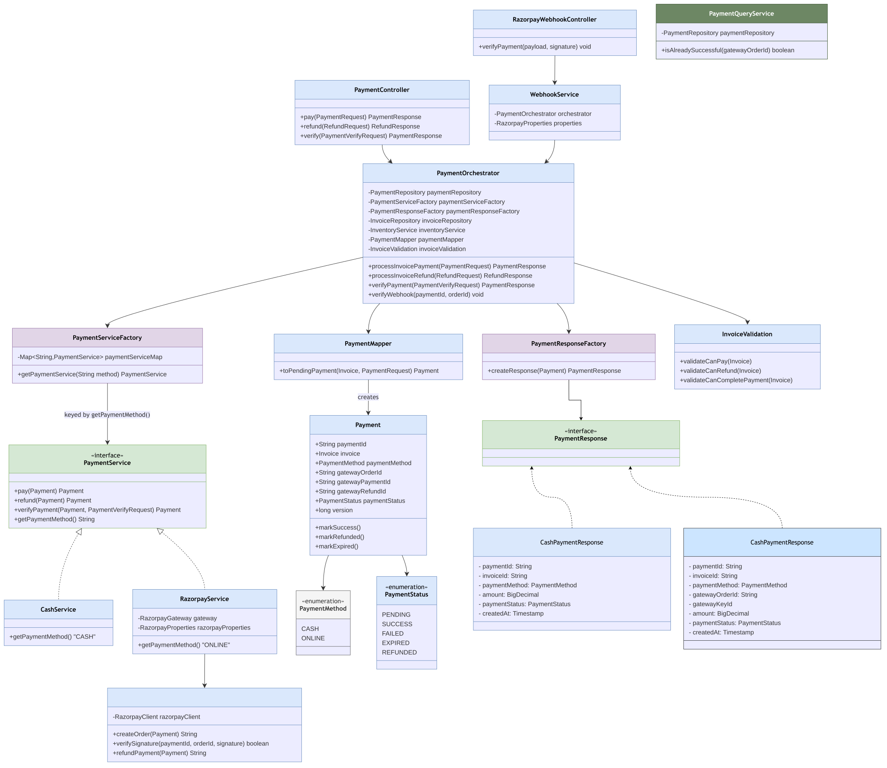

# Payment Module

Package: `in.shivam.retaillite.payment`

## Payment Module — UML Class Diagram

## Payment Flow — Sequence Diagrams

### 1. Pay an Invoice (`POST /payment/pay`)

### 2. Verify Online Payment (`POST /payment/verify` & Razorpay Webhook)

### 3. Refund Flow (`POST /payment/refund`, ADMIN only)

## Responsibility

The most complex module in the codebase: coordinates invoice payments, refunds, and Razorpay
webhook verification behind a single orchestrator, with pluggable payment strategies.

## Key classes

| Class | Role |
|---|---|
| `PaymentController` | `/payment/pay`, `/payment/verify`, `/payment/refund` |
| `RazorpayWebhookController` | `/webhooks/razorpay` — public, signature-verified |
| `PaymentOrchestrator` | Transactional use-case coordinator: validates invoice, checks inventory, invokes the right `PaymentService`, updates invoice/inventory state |
| `PaymentServiceFactory` | Builds a `Map<String, PaymentService>` from all `PaymentService` beans keyed by `getPaymentMethod()` — **Strategy pattern** |
| `PaymentService` (interface) | `pay`, `refund`, `verifyPayment`, `getPaymentMethod` |
| `CashService` | `CASH` strategy — marks payment successful immediately |
| `RazorpayService` | `ONLINE` strategy — creates/verifies/refunds via `RazorpayGateway` |
| `RazorpayGateway` | Thin wrapper over the Razorpay Java SDK (`RazorpayClient`) |
| `WebhookService` | Verifies webhook signature, delegates to `PaymentOrchestrator.verifyWebhook` |
| `PaymentQueryService` | Read-only idempotency check (`isAlreadySuccessful`) in its own transaction |
| `PaymentMapper` | Builds a `PENDING` `Payment` for a new attempt |
| `PaymentResponseFactory` | Produces `CashPaymentResponse` or `RazorpayPaymentResponse` |
| `InvoiceValidation` | Guards: can-pay / can-refund / can-complete-payment |
| `Payment` | Entity with `markSuccess()`, `markRefunded()`, `markExpired()` |

## Business flow highlights

- **Pending-payment reuse:** if a pending payment exists for the same method, it's reused instead of
  creating a duplicate order; switching payment method expires the old pending attempt.
- **Stock is deducted only on success**, and any post-hoc stock shortfall triggers an automatic
  refund + invoice cancellation inside `handlePaymentResult`/`finalizePayment`.
- **Idempotent verification:** both the client-verify endpoint and the webhook check
  `paymentStatus == SUCCESS` before re-processing.

## Adding a new payment method

Add a Spring bean implementing `PaymentService` with a unique `getPaymentMethod()` value — no
changes needed in `PaymentOrchestrator` or `PaymentServiceFactory`.
