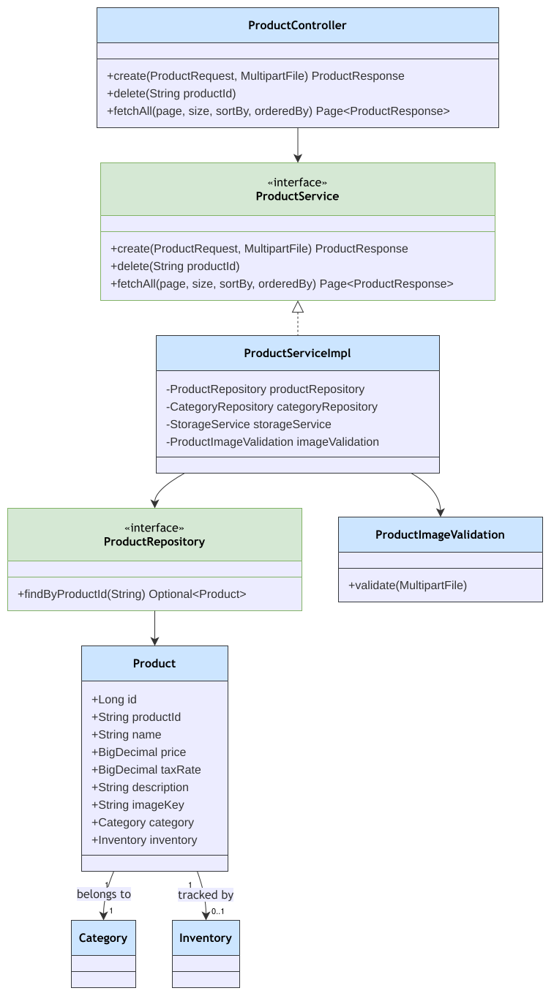

# Product Module

Package: `in.shivam.retaillite.product`

## Product Module — UML Class Diagram

## Responsibility

Owns the product catalog: pricing, tax rate, category linkage, and image upload. Creating a product
also provisions its 1:1 `Inventory` record.

## Key classes

| Class | Role |
|---|---|
| `ProductController` | `/product/**` endpoints |
| `ProductService` / `ProductServiceImpl` | Create, list, delete products |
| `ProductRepository` | Spring Data JPA repository |
| `Product` | Entity: `productId`, `price`, `taxRate`, `category`, `inventory` |
| `ProductImageValidation` | Validates uploaded image files |

## API

| Method | Path | Access | Description |
|---|---|---|---|
| POST | `/product` | `ADMIN` | Create (multipart: JSON + image) |
| GET | `/product/products` | `USER`,`ADMIN` | Paginated list |
| DELETE | `/product/{productId}` | `ADMIN` | Delete |

## Related

See [Inventory Module](inventory.md) for stock tracking, and [Category Module](category.md) for the
mandatory `category` link (`@JoinColumn(nullable = false)`).
