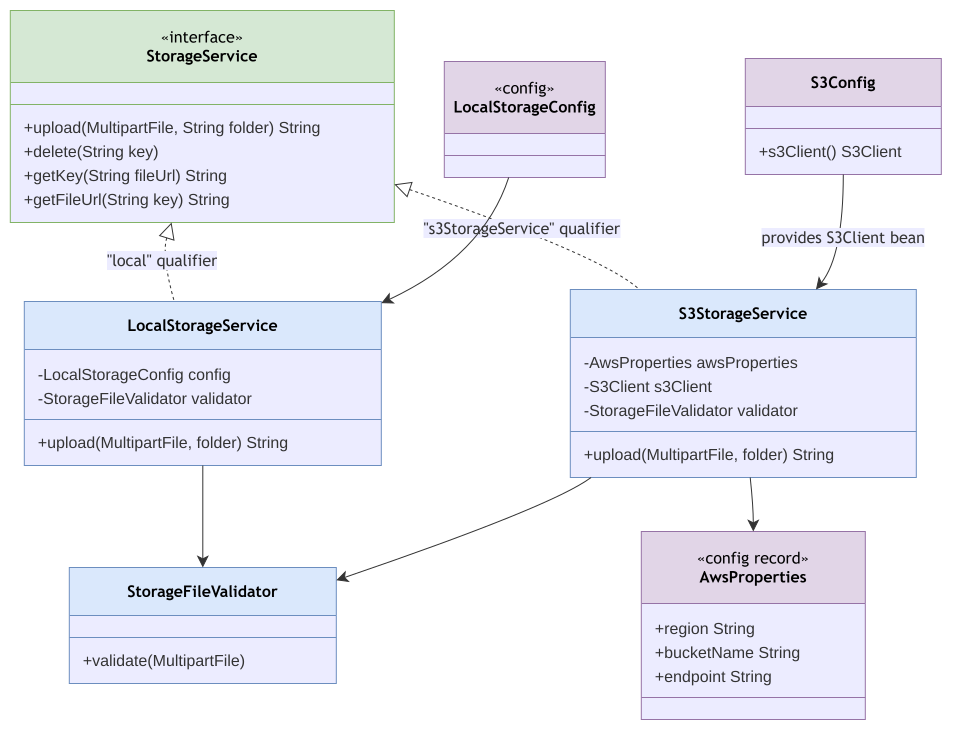

# Storage Module

Package: `in.shivam.retaillite.storage`

## Storage Module — UML Class Diagram

## Responsibility

Abstracts file storage for product/category images behind a single `StorageService` interface,
with two interchangeable backends.

## Key classes

| Class | Role |
|---|---|
| `StorageService` | Interface: `upload`, `delete`, `getKey`, `getFileUrl` |
| `LocalStorageService` | Disk-backed implementation (serves via `/uploads/**`, a public URL pattern) |
| `S3StorageService` | AWS S3-backed implementation *(marked `//todo: incomplete feature` in source)* |
| `StorageFileValidator` | Shared upload validation (used by both backends) |
| `AwsProperties` / `S3Config` | S3 client + bucket/region configuration |
| `LocalStorageConfig` | Local storage configuration |

## Consumers

`CategoryServiceImpl` and `ProductServiceImpl` depend only on the `StorageService` interface —
switching backends requires no changes to either module.
