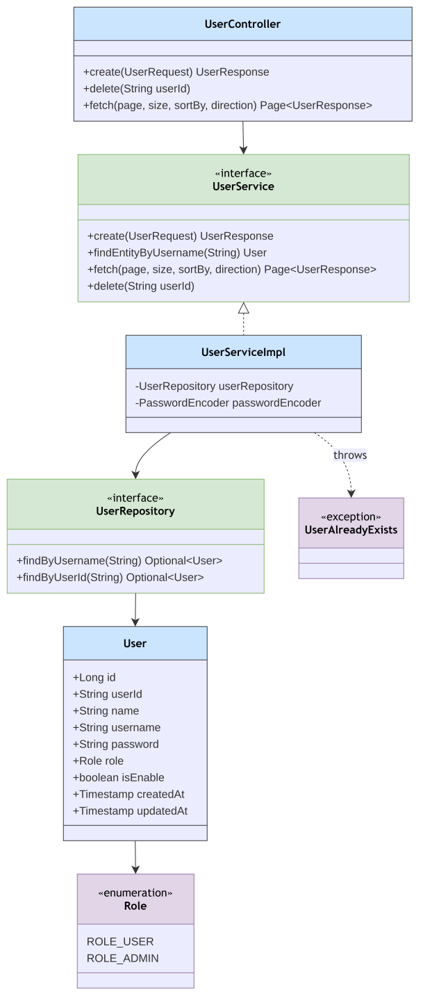

# User Module

Package: `in.shivam.retaillite.user`

## User Module — UML Class Diagram

**Access control:** all endpoints require `hasRole('ADMIN')` (`UserController`) — user management is admin-only.

## Responsibility

Admin-managed staff/user accounts that log in and operate the system (distinct from `customerName`/
`customerEmail` captured directly on an `Invoice`, which are not system users).

## Key classes

| Class | Role |
|---|---|
| `UserController` | `/user/**` — all endpoints `ROLE_ADMIN` only |
| `UserService` / `UserServiceImpl` | Create, list, delete users; `findEntityByUsername` used by auth |
| `UserRepository` | Spring Data JPA repository |
| `User` | Entity: `userId`, `username`, `password` (hashed), `role`, `isEnable` |
| `Role` | Enum: `ROLE_USER`, `ROLE_ADMIN` |
| `UserAlreadyExists` | Thrown on duplicate username/userId |

## API

| Method | Path | Description |
|---|---|---|
| POST | `/user/register` | Create user |
| DELETE | `/user/{userId}` | Delete user |
| GET | `/user/users` | Paginated listing |
